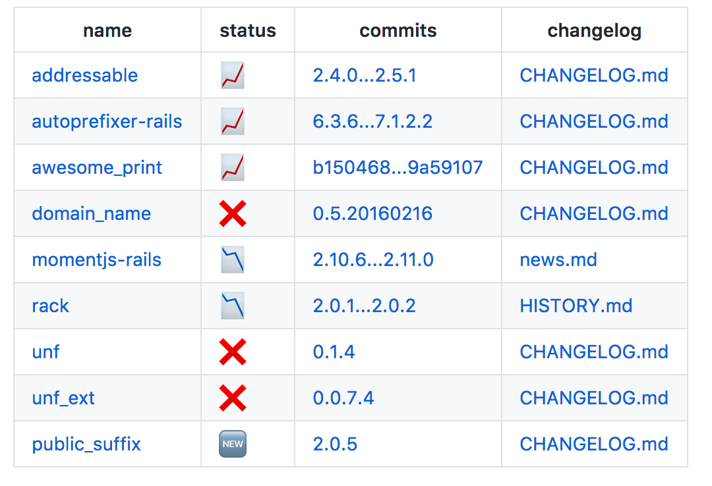

# bundle-update

@vividmuimui
2019/09/10

LT 資料

---

# 定期 bundle update

- tachikoma
    - <https://rubygems.org/gems/tachikoma>
- circleci-bundle-update-pr
    - <https://github.com/masutaka/circleci-bundle-update-pr>
- Dependabot
    - <https://dependabot.com>
- Renovate
    - <https://renovatebot.com>

---

# 🤔 💬

- Dependabot や Renovate が使える環境なら基本的にもうそれで良さそう
    - Dependabot は GitHub では private リポも無料で使えるようになったし
- tachikoma, circleci-bundle-update-pr は、とても便利だけど Changelog へのリンクがなくて大変

---

### tachikoma, circleci-bundle-update-pr Changelog へのリンクがなくて大変

<br>
#### こう思ったことないでしょうか？

---

### そこで lock_diff

---

#### GitHub [vividmuimui/lock_diff](https://github.com/vividmuimui/lock_diff)

#### https://rubygems.org/gems/lock_diff

---

## lock_diff

PRのFiles changedにあるGemfile.lockの変更の差分を見て、
CHANGELOG系ファイルへのリンクをPRにコメントするgem
tachikoma や circleci-bundle-update-pr などが作ったPRを対象にして実行される想定

https://github.com/vividmuimui/lock_diff_sample/pull/9#issuecomment-315140796


---

## lock_diff

changelog といっても、リポジトリによって様々な場所に書かれてる

- CHANGELOG.md
- RELESE_NOTE.txt
- history.md
- GitHub の機能の release
- etc

lock_diff はそれらをよしなに探すようになってる

コード:  [vividmuimui/lock_diff の changelog_url_finder.rb](https://github.com/vividmuimui/lock_diff/blob/032b7270f36915b3da327bbb87c1b185b4338652/lib/lock_diff/github/changelog_url_finder.rb)

---

## 実行の仕方

実行に必要なのは 3つ

- `GITHUB_ACCESS_TOKEN`
- リポジトリ名
    - `vividmuimui/rails_tutorial`
- PR 番号 (省略できる)
    - 基本的には特定のPRに対して実行するのでPR番号が必要
    - でも、最新の bundle update の PR を特定して実行する方法もあるので、省略できる
        - tachikoma, circleci-bundle-update-pr はPR作るときのブランチ名が特徴的なので、それで特定している
        - (ブランチ名が変わると ❌)

```shell
$ lock_diff \
    -r "vividmuimui/lock_diff_sample" \
    -n 9 \
    --post-comment=false

# 最新のPRを特定して実行する場合( `_for_tachikoma` なのは最初 tachikoma しか想定してなかったから)
$ lock_diff_for_tachikoma \
    -r "vividmuimui/lock_diff_sample" \
    --post-comment=false
```

---

## 実行の仕方

circleci で circleci-bundle-update-pr でセットで動かす用の コンテナが用意されてる

[circleci-bundle-update-pr-with-lock-diff](https://github.com/vividmuimui/circleci-runner/tree/master/circleci-bundle-update-pr-with-lock-diff)

---

### ぜひ使ってみてください！

<br>
Dependabot で daily でアップデート、
`circleci-bundle-update-pr-with-lock-diff` で weekly で一括アップデート、
という感じで併用するのも案外良いですよ。

参考: Dependabot vs BundleUpdate+LockDiff
<https://vividmuimui.github.io/slides/dependabot_vs_lockdiff/slides/>

---

## おわりに

- ずっと前に書いて、その時のニーズをある程度実装できたので、全然メンテしてない
- (コードも汚い)
- もっと便利にできたらいいなーとは思ってます(思ってる)
    - https://github.com/vividmuimui/lock_diff/issues
