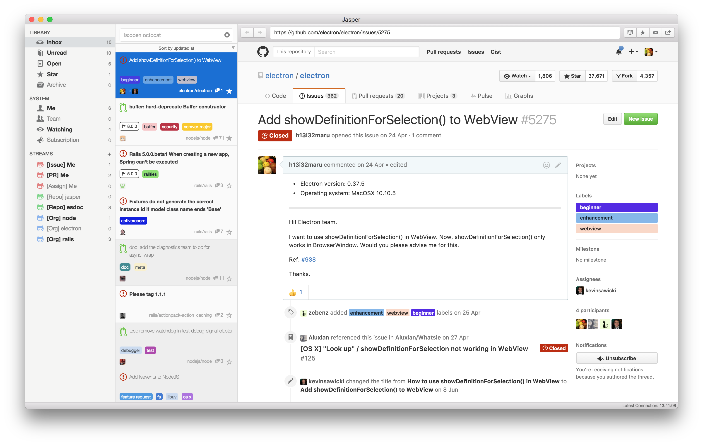
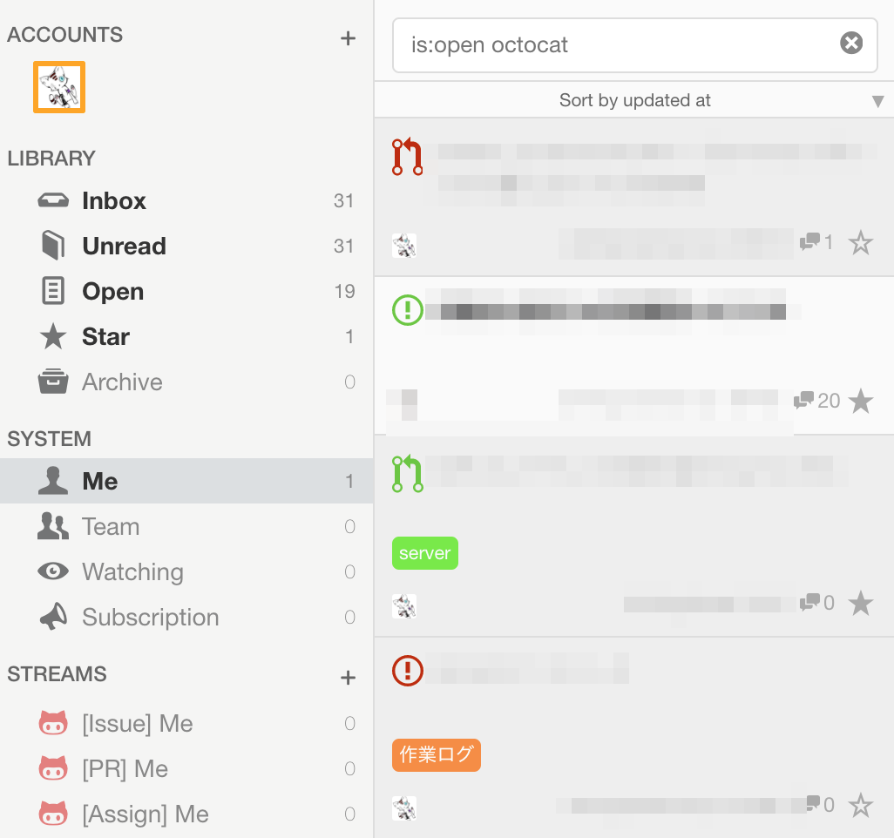
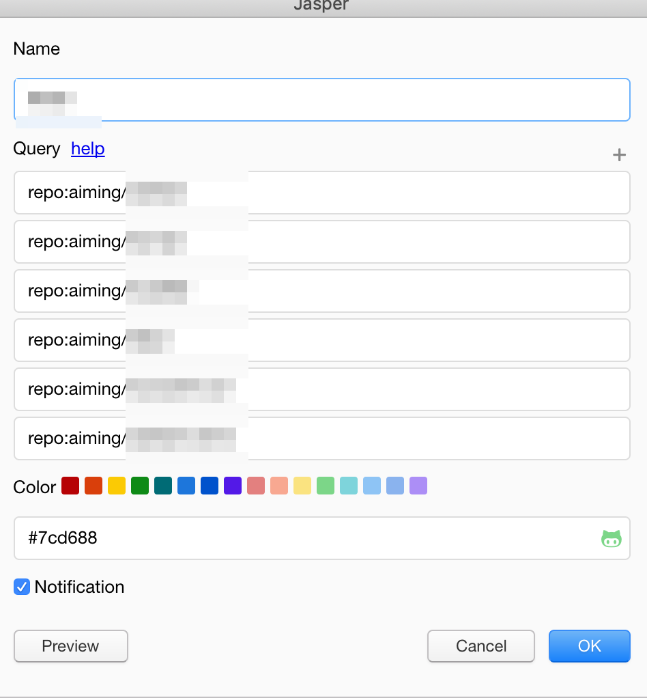

# Jasperはいいぞ!

@vividmuimui
2019/01/16 社内LT

---

## Jasper とは

---

## Jasper とは

GitHubの通知を便利に見れるやつ！
以前は有料でしたが、2018/7に無料化されました。

- https://jasperapp.io/
- https://twitter.com/jasperappio
- https://github.com/jasperapp/jasper

---

## 便利なところ

デフォルトで結構便利

https://github.com/pulls https://github.com/issues https://github.com/notifications あたりのがデフォルトで用意されている。

---

## 便利なところ

> 閲覧したいIssueのStream(RSSフィードみたいなもの)を好きな条件で作成することができます

http://blog.h13i32maru.jp/entry/2016/06/08/090000

これが便利！

---

複数のリポジトリを1つのstreamにまとめることことができたり

---

特定のラベルが付いたものだけをまとめたりできる。

---

https://jasperapp.io/doc.html#stream
https://jasperapp.io/doc.html#filter
http://blog.h13i32maru.jp/entry/2016/06/21/201446

user, repo, label, keywordなど検索自由度はとても高いです

---

## Jasper によってかわること

これまでは、slack通知を頼りに通知を追っていました。

- slack通知だとどうしても見落としてしまうケースがある
- 関わっているリポジトリが多くなると全部見るのは難しい
- slack通知を自分好みにするのは難しい
  - 権限とか調整とか

Jasperだと見たいものを自分好みにfliterできるのでとても良いです。
とくに、見なくて良いものを除くことができるのが圧倒的に便利！

---

## 終わり

https://qiita.com/kohashi/items/faa89fa3a38af93ee84d
ほかにも似たようなアプリはいっぱいあるみたいですし、Jasperも使い始めたばっかりなので、
これ便利だよ！とかこういう使い方あるよ！とかあったら教えてもらえると大変助かります :pray:
