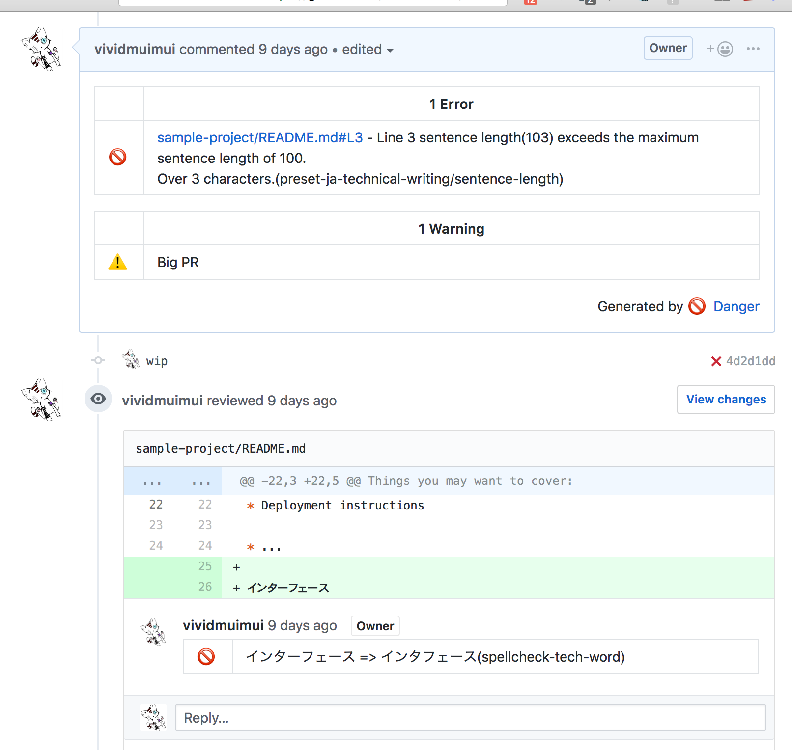
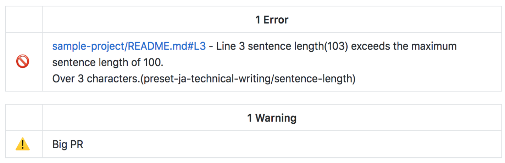

# Danger

@vividmuimui
2018/09/05 社内LT

---


https://danger.systems/ruby/

---

## Danger とは

https://github.com/vividmuimui/danger-sample/pull/7


---

## Danger とは

レビューbot用のツール
jsとrubyで提供されている

---

## サンプル

```ruby
# PRタイトルにWIPついてたら、コメント
warn("PR is classed as Work in Progress") if github.pr_title.include? "[WIP]"

# PRの変更行数が500以上だったら、コメント
warn("Big PR") if git.lines_of_code > 500

# 普通にrubyスクリプトなので、 やりたい放題
fail("fdescribe left in tests") if `grep -r fdescribe specs/ `.length > 1
fail("fit left in tests") if `grep -r fit specs/ `.length > 1

# rubocopなどよく使うやつはpluginがある
rubocop.lint inline_comment: true
```

---

## メリット

- 各種CIやgitのホスティングサービスをサポートしている
- rubocopなどのよく使うどころはプラグインがある
  - プラグインの中見てもだいぶシンプルなので、カスタマイズや自作も簡単
- チーム独自のルールや簡単にかける
  - ruby(js)を書けばいいだけなので簡単＆やりたい放題
  - たとえば `xxx.ja.html` を編集したけど `xxx.zh-TW.html` を編集してなければ警告など

---

# 使い方


注意: ruby, Github, CircleCIでの話です。雰囲気で読み取ってください。

---

## コメント


```ruby
# PRにコメント
message "foo bar"
# markdownとしてコメント
markdown ":alert:"
# CI を落とす
fail "This build didn't pass tests"
# :alert: マークつく
warn "Big PR"

# file changedにコメントもできる
warn("xxxxxx", file: "Dangerfile", line: 10)
```



---

## Git, Github

```ruby
git.added_files
git.modified_files
git.deleted_files
git.lines_of_code

# コミットメッセージ
warn("") if git.commits.any? { |c| c.message =~ /^Merge branch 'master'/ }

# diff
diff = git.diff_for_file("Gemfile.lock")
message("") if diff && diff.patch =~ "nokogiri"
```

```ruby
github.pr_title
github.pr_body
github.pr_labels
github.branch_for_base
# review
github.review.start
github.review.fail(message)
github.review.warn(message)
github.review.submit
```

---

## コードの共有

gemとしてpluginを追加する以外にも色んな方法で追加できる

```ruby
# githubのファイル直指定
device_grid = "https://raw.githubusercontent.com/fastlane/fastlane/master/danger-device_grid/lib/device_grid/plugin.rb"
danger.import_plugin(device_grid)
# local file
danger.import_plugin("danger/plugins/watch_plugin.rb")
danger.import_plugin("danger/plugins/*.rb")
danger.import_dangerfile(path: "path/to/Dangerfile")
# gem
danger.import_dangerfile(gem: "ruby-grape-danger")
# github, gitlab
danger.import_dangerfile(gitlab: "ruby-grape/danger")
danger.import_dangerfile(
  github: "ruby-grape/danger",
  branch: "custom",
  path: "path/to/Dangerfile"
)
```

---

## 導入の仕方

- `Dangerfile` を用意
- danger gemをinstall
- `DANGER_GITHUB_API_TOKEN` を設定
- `bundle exec danger --verbose`とかでdangerを実行

だけ！


---

## ローカルでも動かせる

```sh
danger pr --verbose
```

ただ、対象にするPRが、そのブランチで一番最近マージされたPRを対象にしているっぽい(たぶん)
GithubでオープンになっているPRを対象に実行したりはできなそう(未確認)


---

## 参考

- 公式
  - https://danger.systems
- 試して動かしたやつ
  - https://github.com/vividmuimui/danger-sample
  - https://github.com/vividmuimui/danger-sample/pull/7
- 参考プラグイン
  - https://github.com/ashfurrow/danger-rubocop/blob/master/lib/danger_plugin.rb
- Github検索
  - https://github.com/search?q=warn+filename%3ADangerfile