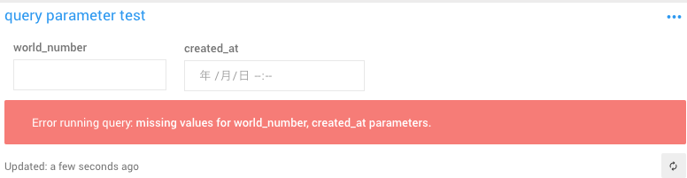
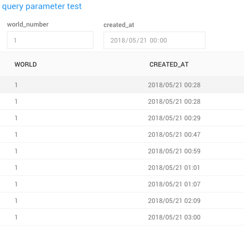

# Redash(少しだけ)使いこなすためのTIPS

@vividmuimui
2018/05/22 社内LT資料

---

# chartの種類

https://redash.io/help/user-guide/visualizations/visualization-types
弱者なので使いこなせてないですけど、色々ある！
他のツールと比べて十分あるかはわからないです!

---

# 色んなdata source

https://redash.io/integrations/
- Mysql
- Amazon Aurora
- Athena
- Bigquery
- Elasticsearch
- SpreadSheet
- Google Analytics

etc

---

# 既存のクエリもData sourceにできる！

https://redash.io/help/user-guide/querying/query-results-data-source

既存のクエリをdata sourceとしてクエリを発行できる
複雑なクエリ1つ書ければ要らないかもしれないが、
小さいクエリ複数をdata sourceとしたほうが簡単なケースも有る

---

# concat使えばURLとか画像とか

```sql
SELECT
  url,
  concat('<a href="', url, '" target="_blank">', name, '</a>') AS url1,
  concat('') AS img
FROM avatar_icons
```

---

# 変数を外から与える

https://redash.io/help/user-guide/querying/query-parameters



```sql
SELECT *
FROM characters
WHERE characters.created_at >= "{{created_at}}"
  AND characters.world = {{world_number}}
```

というように `{{名前}}`で書いてあげると自動的にredashが判断してくれる

---

入力するtypeは、 numberとかdatetimeとかから選択する



---

# dashboardはシェアできる

https://redash.io/help/user-guide/dashboards/sharing-dashboards

dashboardはシェア用のリンクを発行でき、redashのアカウントを持ってない人でも閲覧できる

---

# publish, unpublish

https://redash.io/help/user-guide/querying/writing-queries#publishunpublish

クエリをsaveした直後は `unpublish`(下書き状態)になっていて、他のユーザーからは見れない
publishすることで他のユーザーから見えるようになる。クエリ一覧にも表示されるようになる

---

# refresh shedule

https://redash.io/help/user-guide/querying/scheduling-a-query

クエリの定期実行ができる
結果をキャッシュしてくれるので、結果のページがさくっと開ける

---

# 書いてない話

- redashの結果を外部に公開
  - api, embed, slack bot etc
- alerts
- dashboardのtext boxesを使った入力フォーム
  - https://blue1st-tech.hateblo.jp/entry/2016/09/04/224200
  - 環境変数の設定が必要
- etc
